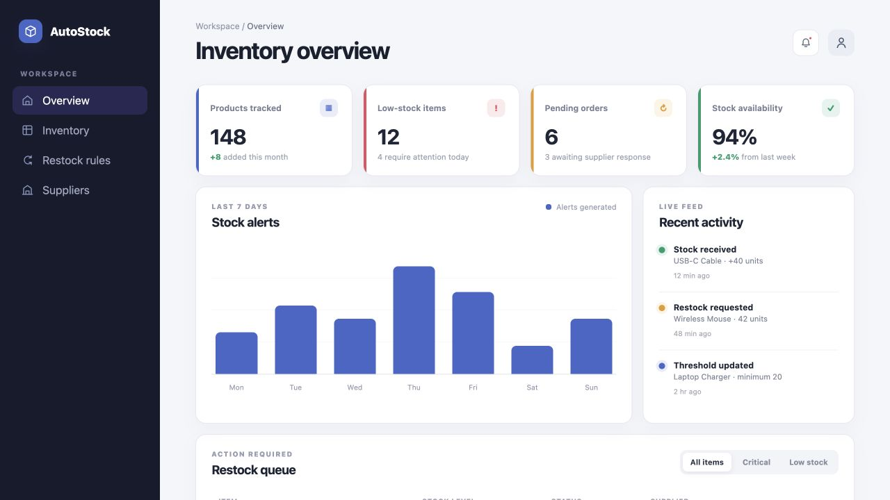
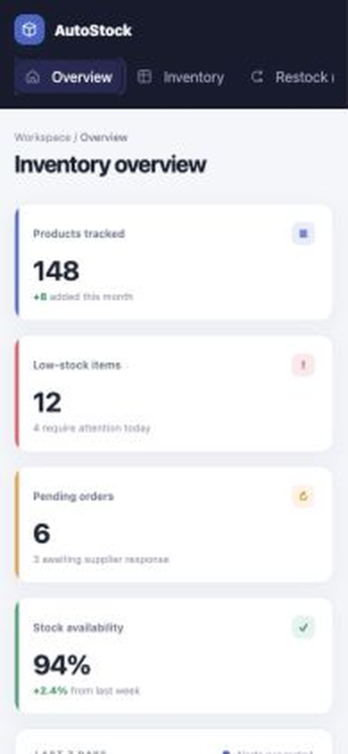
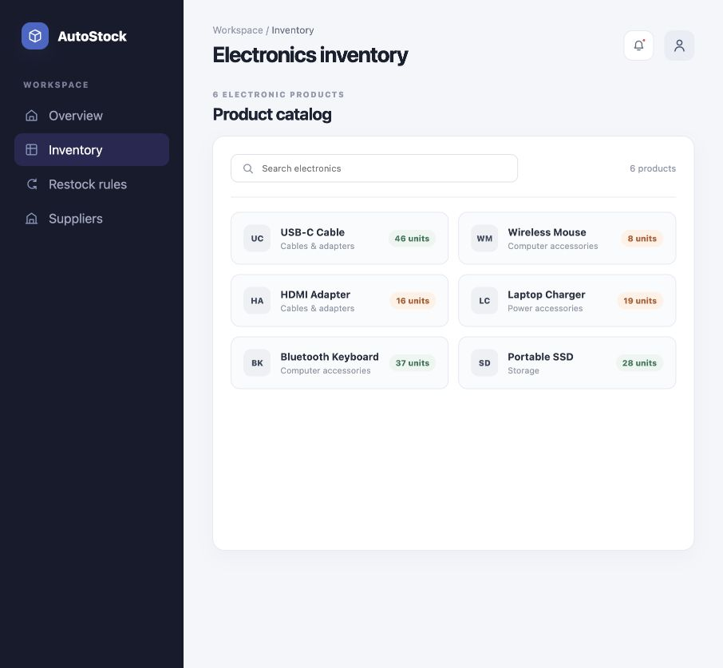
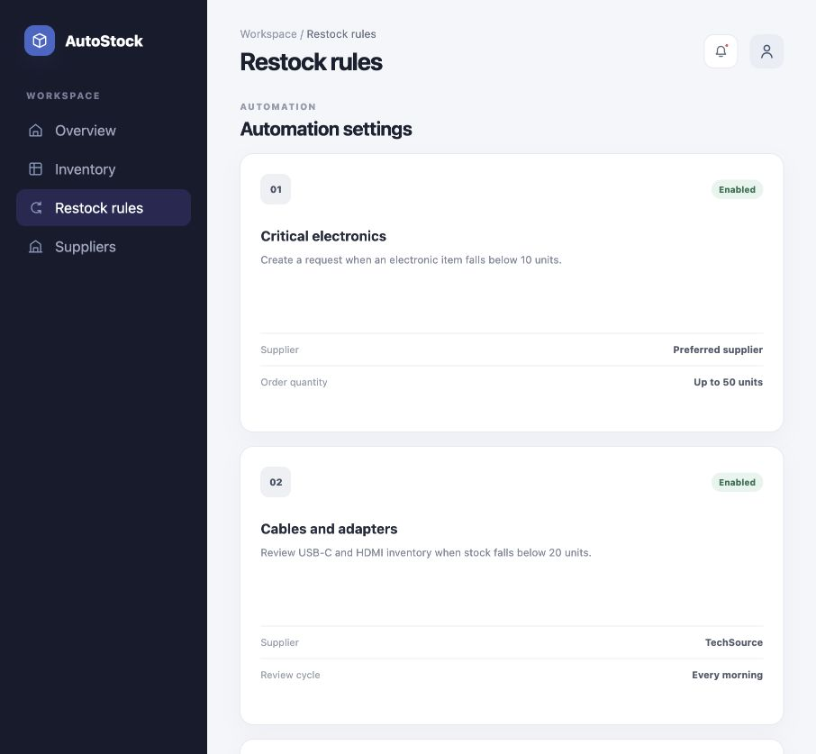
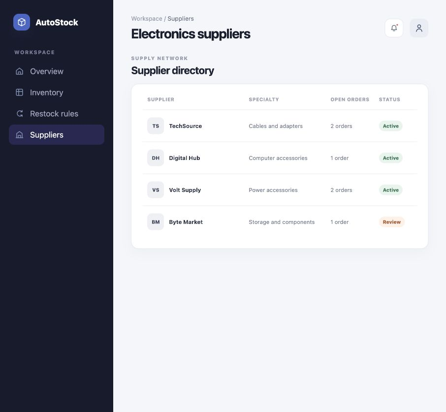

# AutoStock Inventory System Analysis

AutoStock is an academic systems-analysis project for an inventory platform that tracks stock levels and supports an automatic restocking workflow with suppliers.





## Project status

**Original submission: design and analysis prototype.** The reviewed course files contain requirements, diagrams, and interface designs rather than an implemented system.

**Portfolio revision: static interactive frontend.** A responsive HTML, CSS, and JavaScript dashboard was added during portfolio preparation. It uses sample electronics data and simulated interface actions. It is not connected to a backend, database, authentication system, or supplier.

## My contribution

This was a team project. My contribution covered:

- Designing the Figma interfaces for the dashboard, inventory view, and automatic-restocking workflow.
- Creating the event table.
- Writing the functional and non-functional requirements table.
- Creating the UML use case diagram.

Other report sections and diagrams were produced by the project team and are not presented as my individual work.

## Proposed features

- Staff and administrator login.
- Inventory listing and stock-level monitoring.
- Stock updates after sales or deliveries.
- Low-stock detection.
- Supplier restocking requests.
- Administrative access to manage inventory records.

## Portfolio prototype features

- Four separate responsive screens: Overview, Inventory, Restock Rules, and Suppliers.
- Electronics-only sample catalog with search.
- Sample inventory metrics, alert chart, activity feed, and restock queue.
- Status filters for critical and low-stock items.
- Simulated restock-request dialog with visible confirmation.

### Additional screens

| Electronics inventory | Restock rules | Suppliers |
| --- | --- | --- |
|  |  |  |

## Run locally

Start a local server from the repository folder:

```bash
python3 -m http.server 8000
```

Then open <http://localhost:8000>.

## Tests

The repository includes a browser smoke test for all four navigation screens, electronics search, stock-status filtering, and the restock request flow:

```bash
npm install
npx playwright install chromium
npm test
```

The prepared version was also checked manually at desktop and mobile sizes on September 8, 2026.

## Artifacts

### Event table


### Functional and non-functional requirements


### Use case diagram


## How to use this repository

Open the portfolio prototype to filter sample stock states and try the simulated restock flow. Review the original images in `docs/` to compare the course artifacts with the later portfolio revision.

## Validation

The original artifacts were visually checked against the course report. The portfolio frontend is tested separately as a static prototype; these checks do not validate a real inventory workflow.

## Known limitations

- The course system behavior is proposed rather than implemented; the added frontend only simulates selected interactions.
- Performance targets, security controls, database behavior, and supplier communication were not tested.
- The original `.fig` export is not included in the public-ready folder because its embedded metadata and third-party image provenance could not be fully verified. A public-safe Figma share link or clean frame export can be added later.
