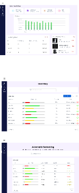
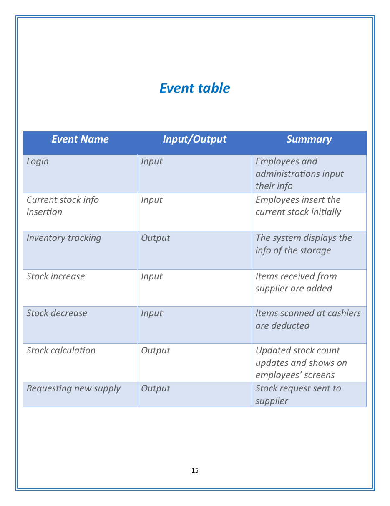
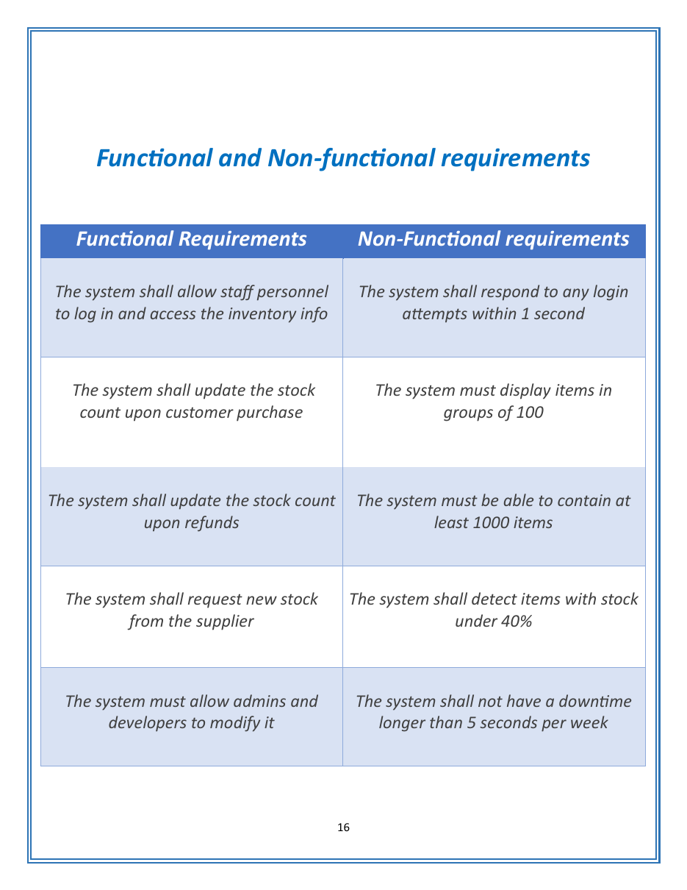
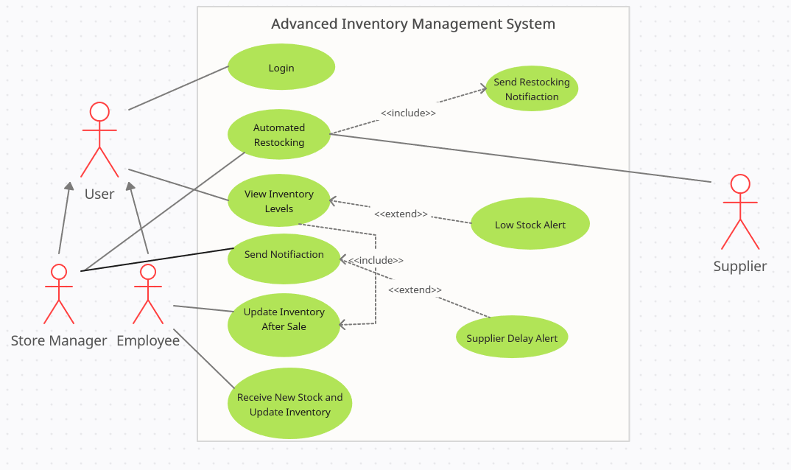

# AutoStock Inventory System Analysis

AutoStock is an academic systems-analysis project for an inventory platform that tracks stock levels and supports an automatic restocking workflow with suppliers.

## Project status

**Design and analysis prototype.** The reviewed files contain requirements, diagrams, and interface designs. They do not contain a working application, backend, database, authentication system, or supplier integration.

## My contribution

This was a team project. My contribution covered:

- Designing the Figma interfaces for the dashboard, inventory view, and automatic-restocking workflow.
- Creating the event table.
- Writing the functional and non-functional requirements table.
- Creating the UML use case diagram.

Other report sections and diagrams were produced by the project team and are not presented as my individual work.

## Proposed features

- Staff and administrator login.
- Inventory listing and stock-level monitoring.
- Stock updates after sales or deliveries.
- Low-stock detection.
- Supplier restocking requests.
- Administrative access to manage inventory records.

## Artifacts

### Event table

### Functional and non-functional requirements

### Use case diagram

## How to use this repository

There is no executable setup. Review the images in `docs/` to follow the proposed workflow and system scope.

## Validation

The portfolio copy was visually checked against the course report. Software tests were not run because no implementation was supplied.

## Known limitations

- The system behavior is proposed rather than implemented.
- Performance targets, security controls, database behavior, and supplier communication were not tested.
- The original `.fig` export is not included in the public-ready folder because its embedded metadata and third-party image provenance could not be fully verified. A public-safe Figma share link or clean frame export can be added later.

